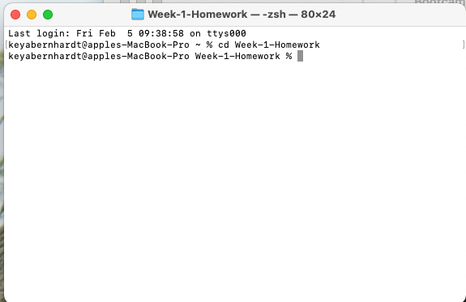
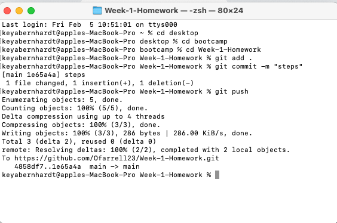
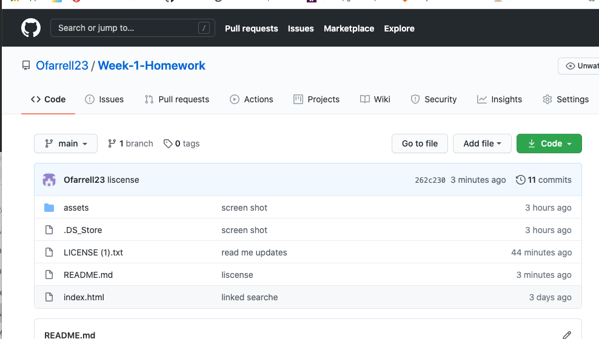

# Week-1-Homework

## Table of Contents

* [Overview](#Overview)
* [Installation](#installation)
* [Usage](#usage)
* [Credits](#credits)
* [License](#license)

## Overview
For this project we were tasked to create a repository in Github and be able to push our file directory from our main source to that repositiory. The files to be uploaded included a README. MD, Liscense.txt, assets, and Index html. We were also tasked to correct any broken links in the provided html, and reformat the the code to have correct syntax. My motivation for this project was to strengthen my Github experience by better familiarize myself with using terminal to add, commit, and push data to Github. In addition to the Github experience, I also gained better knowlege of how information should be displayed on a html and CSS page.

## Installation
Steps to install and run Github.

1. Create a Github account
2. Within Github.com create a new Repository.
3. Once your new repository is created make a name for your repository and click the public button, and initializ this repository with README
4. Copy the link associated with the recently created repository. 

5. While using the terminal type CD (change directory)to enter the correct file folder. In my case it was cd Week-1-Homework 

6. In the terminal type git clone _____ and paste the previous https: copied from the Github repository recently created.

7. Go the the folder created in the previous step, you should see a new README.MD folder at a git folder.

8. Create a HTML folder in the the current folder you recently created which contains the README.MD

9. Return back to the terminal, text (git add .) then (get commit -m "message") then (git push) 

10. Return to Github and you should see the new html folder located in your repository.

## Usage 

https://ofarrell23.github.io/Week-1-Homework/

## Credits

Below is a list of third-party tutorials used to help facilitate this project. There were no collaborators for this project.

* [Credits] (https://www.w3schools.com/tags/att_img_alt.asp)
* [Credits] (https://www.vikingcodeschool.com/html5-and-css3/html5-semantic-tags)

## License

[https://choosealicense.com/licenses/gpl-3.0/](https://choosealicense.com/licenses/gpl-3.0/) 

