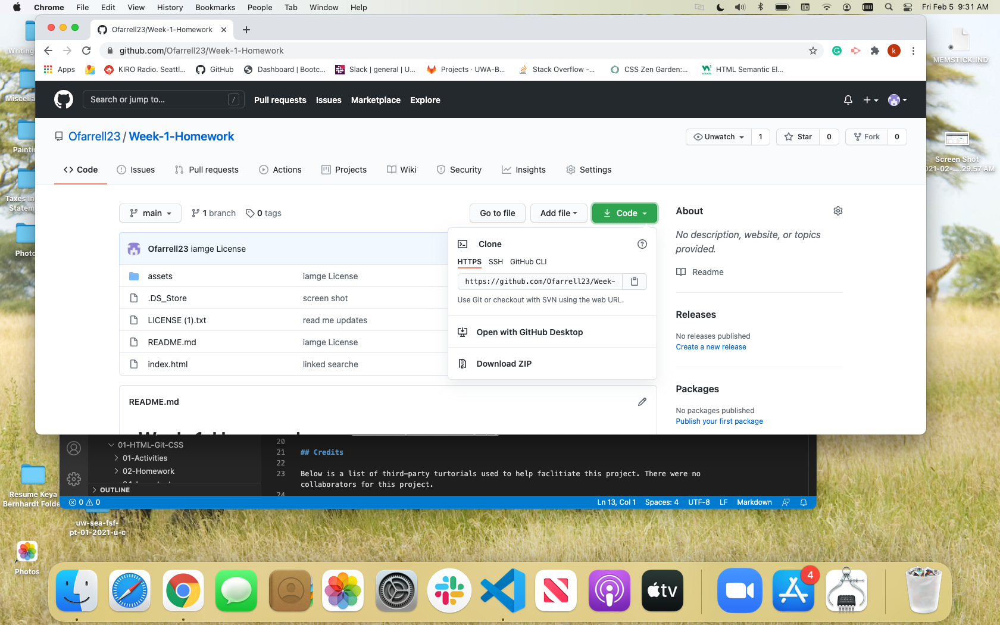

# Week-1-Homework

## Overview
For this project we were tasked to create a repository in Github and be able to push our file directory from our main source to that repositiory. The files to be uploaded included a README. MD, Liscense.txt, assets, and Index html. We were also tasked to correct any broken links in the Index.html, and reformat the the code to have correct syntax. My motivation for this project was to strenghten my Github experience by better familarizing myseft with using termainal to add, commit, and push data to Github. In addition to the Github experience, I also gained better knowlege of how information should be diplayed on a html and CSS.

## Installation
Steps to install and run Github process.

* [Steps]
Step #1 Create a Github account
Step #2 Within Github.com creat a new Respository
Step #3 Once your new repository is created make a name for you reposistory and click the public buttn, and initializ this repository with README
Step #4 Copy the link associated with the recently created respository 

## Usage 

https://ofarrell23.github.io/Week-1-Homework/

## Credits

Below is a list of third-party turtorials used to help faclitiate this project. There were no collaborators for this project.

* [Credits] (https://www.w3schools.com/tags/att_img_alt.asp)
* [Credits] (https://www.vikingcodeschool.com/html5-and-css3/html5-semantic-tags)

